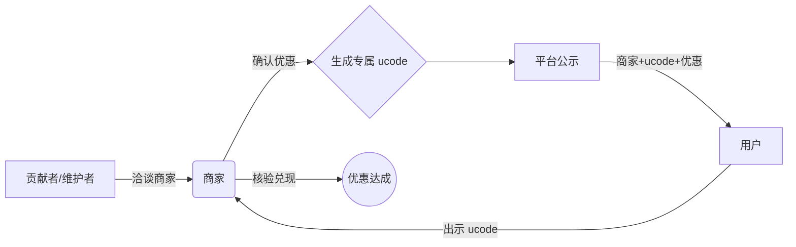

# 优码（ucode）开源项目：有码就有优惠 🎁

  

> ⚠️ **重要提示**：参与本项目（使用/贡献/接入）即视为同意遵守 [**优码核心公约**](./03-项目管理文档/优码核心公约.md)。

> **核心逻辑**：「有码就有优惠」—— 社区贡献者洽谈商家 -> 生成专属 ucode -> 商家自愿接入 -> 用户享优惠。

---

## 📖 项目简介

优码（ucode）是一个**全民协作的开源专属优惠码平台**。
*   🚫 **无商业佣金**
*   🚫 **无广告植入**
*   ✅ **主打「精准、无门槛、全民共建、三方共赢」**

我们希望通过开源协作，打破传统优惠平台的壁垒，让小商家零成本获得曝光，让用户轻松获取无套路优惠，让每一位贡献者都能参与共建、共享价值。

## 🔄 核心逻辑（极简闭环）

## 🔥 热门优惠商家 (实时更新)

> 完整列表请查看 [**01-优码核心数据**](./01-优码核心数据/)

| ucode 编号 | 商家名称 | 优惠内容 | 有效期 | 状态 |
| :--- | :--- | :--- | :--- | :--- |
| **UC0001** | 非常英语母词速记 | 下载荔课APP，在APP内搜索“母词速记”，选择《母词速记英语3000词》（价格299）或《母词速记英语5000词》（价格369） 下单购买后，联系客服，即享受60元现金红包| 长期 | 🟢 生效 |
| **UC0002** | 等你来| 等你来 | 等你来 | == 待生效 |

## 🚀 快速上手指南

### 👥 普通用户：如何使用 ucode？
1.  进入 [**01-优码核心数据**](./01-优码核心数据/) 文件夹，按品类/城市找到心仪商家的 ucode。
2.  线下到店或线上沟通时，向商家出示对应 ucode。
3.  商家核验无误后，即可享受专属优惠。
4.  若遇到商家拒绝兑现、ucode 失效等问题，可通过 [**虚假信息举报模板**](./02-协作模板/虚假信息举报模板.md) 提交反馈。

### 🏪 商家：如何接入 ucode？
1.  无需付费、无需入驻门槛，自愿认可 ucode 的优惠规则。
2.  可主动联系项目维护者，或等待社区贡献者洽谈合作。
3.  确认优惠内容后，我们将为您生成专属 ucode，公示在平台上。
4.  用户出示 ucode 时，按约定兑现优惠。可随时申请修改/注销 ucode（需提前 3 个工作日告知）。

### 🤝 贡献者：如何参与共建？
所有操作均在 GitHub 上完成，零开发基础可参与！
*   **商家洽谈**：对接本地/线上商家，确认合作意向并申请 ucode。
*   **信息维护**：整理商家/ucode 信息，更新优惠状态（生效/失效）。
*   **内容核验**：核验 ucode 有效性、商家优惠兑现情况，举报虚假信息。
*   **规则优化**：提交 PR，提出文档/规则的优化建议。

👉 详细流程请见 [**贡献者协作指南**](./03-项目管理文档/贡献者协作指南.md)。
👉 商家洽谈可参考 [**商家洽谈话术**](./04-资源与工具/商家洽谈话术.md)。

## 📂 核心资源导航

| 资源名称 | 说明 | 路径 |
| :--- | :--- | :--- |
| **🔍 优码数据** | 所有生效/失效 ucode 及商家信息 | [01-优码核心数据](./01-优码核心数据/) |
| **📋 协作模板** | ucode 申请、变更、核验等标准化模板 | [02-协作模板](./02-协作模板/) |
| **📖 规则文档** | ucode 管理、商家接入、贡献者指南 | [03-项目管理文档](./03-项目管理文档/) |
| **🛠️ 辅助工具** | 商家洽谈话术、免费图床推荐 | [04-资源与工具](./04-资源与工具/) |

## 🏆 核心贡献者榜单

| 贡献者 GitHub 昵称 | 贡献类型 | 贡献内容（简要） |
| :--- | :--- | :--- |
| [你的昵称] | 项目发起+维护 | 项目搭建、规则制定、核心商家洽谈 |
| [示例贡献者] | 商家洽谈 | 对接 XX 城市餐饮类商家，新增 5 个 ucode |

> 💡 持续更新，所有贡献者的操作均会在 GitHub 提交记录中留痕，核心贡献者可成为项目维护者。

## 📢 项目公告

*   🔥 **【招募】** 项目处于初期启动阶段，重点招募 **[你的城市]** 的商家洽谈者和信息维护者，欢迎加入！
*   ℹ️ **【审核】** 所有 ucode 申请需提交商家合作证明，审核周期不超过 24 小时，审核结果会在对应 Issue 中回复。

## ⚖️ 优码核心公约 & 开源协议

> **📜 [优码核心公约](./03-项目管理文档/优码核心公约.md)** 是本项目的基石，规定了商家、用户、贡献者三方的权利与义务。所有参与者均视为同意此公约。

本项目采用 [MIT 开源协议](LICENSE)，允许任何人修改、传播、使用，无需经过项目维护者许可，但需保留原作者信息和项目链接，**禁止用于商业盈利目的**。

## 📞 联系我们

*   **项目发起者 GitHub**：[frank36512](https://github.com/frank36512)
*   **项目仓库**：[https://github.com/frank36512/ucode](https://github.com/frank36512/ucode)

